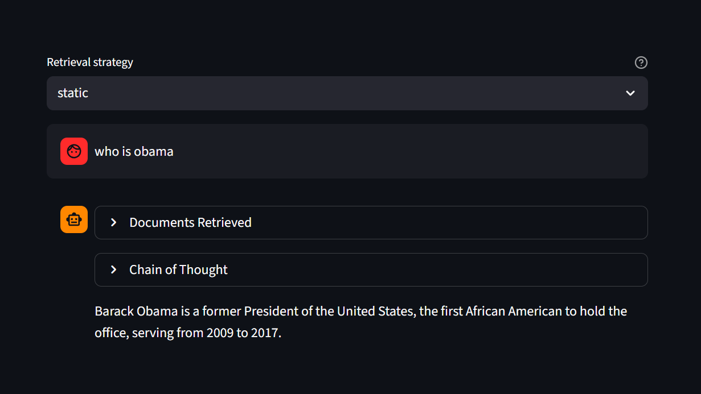

# 🤖 qwenRAG

Built a fully local chatbot using LangGraph + Ollama, powered by the HotpotQA dataset. No API keys required. It can retrieve and display the relevant documents and clearly show its chain-of-thought reasoning process.

### ✨ What you can do with this project

- Chat with a local assistant using multiple retrieval modes (`sparse`, `static`, `dense`)
- See which documents were retrieved in the Streamlit UI
- Optionally run batch prediction and evaluation scripts

## 🧰 Requirements

- Python 3.12+
- [uv](https://docs.astral.sh/uv/)
- [Ollama](https://ollama.com/)

## 🚀 Quick Start (Chatbot)

Pick one path and run commands from the repository root.

### 🖥️ Local (recommended)

This is the easiest way for first-time users.

```bash
uv sync
ollama pull qwen2.5:7b-instruct
uv run python src/rag_agent/dataloader.py
uv run streamlit run src/rag_agent/chatbot.py
```

Open `http://localhost:8501`.

Notes:

- Run `src/rag_agent/dataloader.py` on first setup, or whenever `data/collection.jsonl` changes.
- You do not need to activate a virtual environment manually.

### 🐳 Docker Compose

Use this if you prefer containerized setup.

```bash
docker compose up -d --build
docker compose exec ollama ollama pull qwen2.5:7b-instruct
docker compose exec chatbot uv run python src/rag_agent/dataloader.py
```

Open `http://localhost:8501`.

## 🖼️ Chatbot UI Preview




## 🌟 Optional Workflows

These are not required to run the chatbot.

### 🏭 Batch generation

```bash
uv run python src/rag_agent/batch_generate.py -f data/test.jsonl -e dense
```

Options:

- `-f, --file`: input JSONL with at least `id` and `text`
- `-e, --embed`: retrieval mode (`static`, `dense`, `sparse`, `qwen`)
- `-s, --skip_chain`: skip chain node and answer directly from retrieved context

Output: `results/<input_stem>_<embed>.jsonl`

### 📊 Evaluate retrieval

```bash
uv run python src/eval/eval_retrieval.py
```

Override defaults if needed:

```bash
uv run python src/eval/eval_retrieval.py \
  --gold data/validation.jsonl \
  --pred results/validation_dense.jsonl \
  --k_values 2 5 10
```

Metrics reported: MAP, NDCG, Recall, Precision.

### 🧪 Evaluate QA + supporting docs

```bash
uv run python src/eval/eval_hotpotqa.py
```

Override defaults if needed:

```bash
uv run python src/eval/eval_hotpotqa.py \
  --gold data/validation.jsonl \
  --pred results/validation_dense.jsonl \
  --topk 10
```

Metrics reported: answer EM/F1, supporting-doc metrics, and joint metrics.

## ⚙️ Configuration

Runtime config: `configs/agent.yaml`

- `llm`: model and generation settings
- `data.collection_path`: source corpus JSONL
- `rag.vector_store.persistence_dir`: Chroma persistence path
- `rag.retriever.embedding`: embedding models for retrieval modes
- `batch`: default dataset, output directory, embedding type

Evaluation config: `configs/eval.yaml`

- `defaults.gold` / `defaults.pred`: default files used by eval scripts
- `retrieval.k_values`: retrieval metric cutoffs
- `hotpotqa.topk`: number of retrieved docs considered in QA eval

## 🐳 Docker Notes

- `Dockerfile` builds the chatbot image
- `docker-compose.yml` runs `chatbot` + `ollama`
- `ollama-data` volume persists pulled Ollama models
- `./data` and `./results` are mounted into the chatbot container

Useful commands:

```bash
docker compose logs -f chatbot
docker compose down
```

## 🧾 Data Format

Typical input row (for example, `data/validation.jsonl`):

```json
{
  "id": "...",
  "text": "question",
  "answer": "gold answer",
  "supporting_ids": ["doc-1", "doc-2"]
}
```

Typical batch output row:

```json
{
  "id": "...",
  "text": "question",
  "answer": "predicted answer",
  "retrieved_docs": [
    ["doc-1", 0.67],
    ["doc-2", 0.59]
  ]
}
```

## 🗂️ Project Layout

```text
qwenRAG/
├── configs/
│   ├── agent.yaml
│   └── eval.yaml
├── data/
├── results/
└── src/
    ├── rag_agent/
    │   ├── chatbot.py
    │   ├── dataloader.py
    │   ├── retriever.py
    │   ├── rag.py
    │   └── batch_generate.py
    └── eval/
        ├── eval_retrieval.py
        └── eval_hotpotqa.py
```


## 🙋 Need Help?

- If the chatbot starts but answers look empty, run the dataloader again.
- If Ollama model is missing, run `ollama pull qwen2.5:7b-instruct`.
- If Docker is running but UI is unavailable, check logs with `docker compose logs -f chatbot`.

## ⭐ Support This Project

If you like this project, give it a ⭐ on GitHub.
